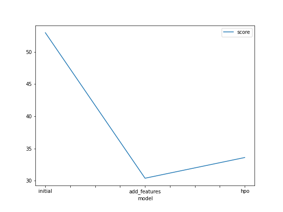
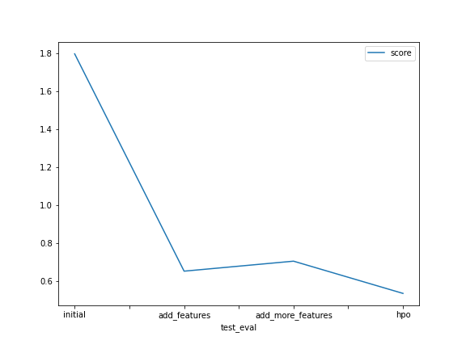

# Report: Predict Bike Sharing Demand with AutoGluon Solution
#### Kyle Schmidt

## Initial Training
### What did you realize when you tried to submit your predictions? What changes were needed to the output of the predictor to submit your results?
When I first tried to submit my predictions, I noticed that the test dataset didn't have a 'count' label column. The test and training datasets need to be the same so I added a 'count' column and initialized the values to 0.

The notebook outline stated to check for any predicted values less than 0 but when I checked in this initial round no values were less than 0 so I was ok to add my predictions to the submission dataset directly and submit.

### What was the top ranked model that performed?
The top ranked model that consistently prerformed the best was the 'WeightedEnsemble_L3' model. However, this model was bested when I performed hyperparameter tuning and 'WeightedEnsemble_L2' became the highest performing from a Kaggle score perspective. Its model score wasn't better than the 'WeightedEnsemble_L3' model.

## Exploratory data analysis and feature creation
### What did the exploratory analysis find and how did you add additional features?
I ran `feature_importance` on the initial model to see what features worked best. From these results, I noted that 'datetime' and 'holiday' features were most important. Using that information, I tried to parse 'datetime' further into subcomponents, creating separate features for year, month, day, hour, and weekday. The 'holiday' column was already in a boolean format, indicating True/False if the day was a holiday and I attempted to turn season and weather into categorical features and create separate dummy columns for those as well. However, season and weather didn't seem to have a large affect on model performance because after I created them, re-ran the model, and then again calculated feature importance, those new categorical dummy columns all ranked at the bottom.

### How much better did your model preform after adding additional features and why do you think that is?
My model performance improved a surprising amount largely due to splitting the datetime column. The model score improved from 52.98 to 30.37 after adding the additional features. Presumably this is better because 'datetime' isn't initially a numerical value that the model can work with. By spliting the datetime column (first a string into a datetime object and then into subcomponent numerical columns) this specicifically tells the model how to handle the datetime feature. Using the datetime, we were also able to create additional features in addition to our datetime splits. My additional feature 'weekday' was a good one to add which indicated whether the date was a weekend day or not.

## Hyper parameter tuning
### How much better did your model preform after trying different hyper parameters?
I was able to improve my model after trying to tune hyperparameters. I configured the model without any hyperparameters first and a 10 minute time limit which provided a good model. I then tried to remove the time limit and set the hyperparameters to 'auto' but that made the score worse (I should caveat that it made the model score improve but the kaggle score didn't improve). My model improved from 30.36 to 29.10. I then specifically chose 4 models: Neural Net, Catboost, Linear Regression, and Gradient Boost and chose specific hyperparameters for each (see notebook). I also set overall hyperparameter arguments, auto search, local scheduler, and num_trials = 5 in order to define the number of hpo trials to perform and the search algorithm used by the hpo experiment.

### If you were given more time with this dataset, where do you think you would spend more time?
Given more time, I might try to remove features and see if that helps since some features might be correlated and/or confusing the model. Including my new 'year' feature might be problematic if we're trying to predict future ridesharing volume, for example. Another thing that we were taught in the lessons was about normalizing data so that numerical data takes on a specific range of values. I didn't use that technique in my data cleansing and feature engineering but I might want to go back and try that out. I would have also liked to try other types of models and compare them against AutoGluon.

### Create a table with the models you ran, the hyperparameters modified, and the kaggle score.
|model|hpo1|hpo2|hpo3|score|
|--|--|--|--|--|
|initial|NULL|NULL|NULL|1.797|
|add_features|NULL|NULL|NULL|0.65075|
|hpo|'hyperparameter_tune_kwargs = { 
  'num_trials': 5,
  'scheduler' : 'local',
  'searcher': 'auto',
} &     'NN_TORCH': {
        'num_epochs': 10,
        'batch_size': 100,
        'learning_rate': 0.5
    }'|'hyperparameter_tune_kwargs = { 
  'num_trials': 5,
  'scheduler' : 'local',
  'searcher': 'auto',
} &     'GBM': {
        'num_boost_round': 600,
        'num_leaves': ag.space.Int(lower=20, upper=70, default=36),
        'ignore_column': 'year',
    }'|'LR': {},|.53346|

### Create a line plot showing the top model score for the three (or more) training runs during the project.

### Create a line plot showing the top kaggle score for the three (or more) prediction submissions during the project.

## Summary
I learned a lot through this project and applied nearly everything I learned from the classes. I learned that feature engineering and data cleansing is probably the most important as that yielded the greatest improvement in model score. Hyperparameter tuning is also important but the data going into the model is what provided us the greatest boost. I also learned that AutoGluon performs reasonably well with the default hyperparameters and now I understand the power of AutoML frameworks and their ability to yield really good performance with minimal setup. Again, the data fed into them matters the most and by spending more time in data cleansing and feature engineering one can yield the greatest benefits.

My results showed that if one wants to predict bike demand using the dataset, the most important features are hour and workingday. The best model to use is going to be a combination of assembled models.